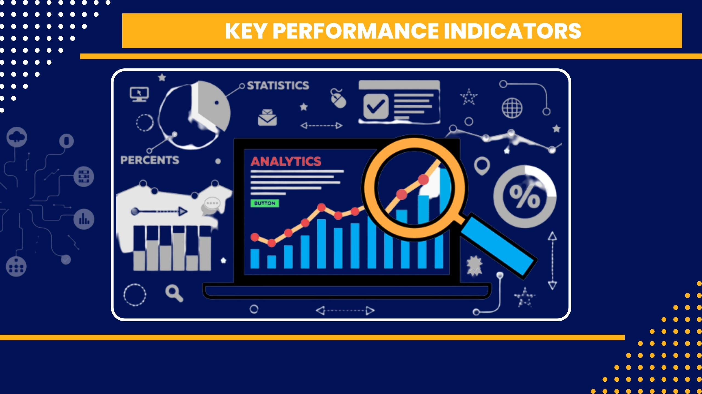
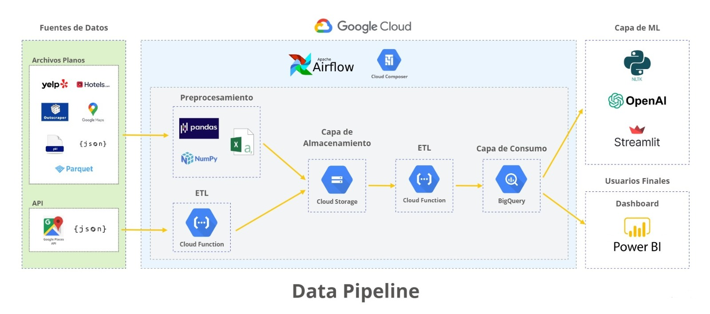
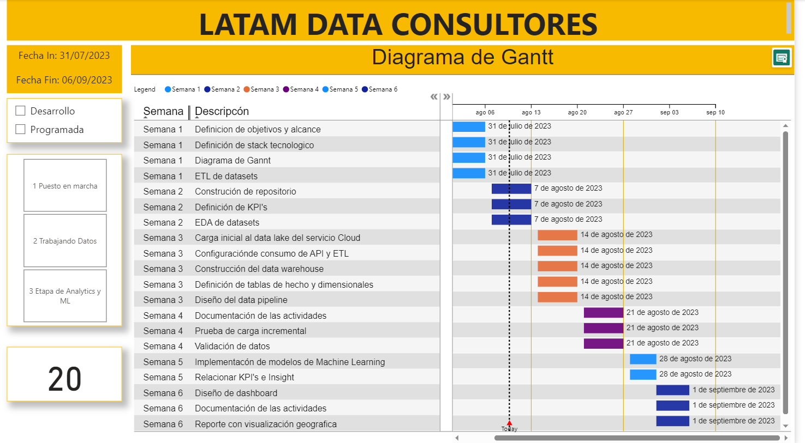

  

# Tabla de Contenido

- [Estructura del repositorio](#estructura-del-repositorio)
- [Autores](#autores)
- [Introduccion](#introduccion)
- [Objetivos y Alcance](#objetivos-y-alcance)
- [Key Performance Indicators](#key-performance-indicators)
- [Flujo de Datos](#tratamiento-de-datos)
- [Stack Tecnologico](#stack-tecnologico)
- [Planificacion de esfuerzos](#planificacion-de-esfuerzos)
- [Analisis Exploratorio de Datos Preliminar](#analisis-exploratorio-de-datos-preliminar)
- [Construccion y Evaluacion de Modelos](#construccion-y-evaluacion-de-modelos)
- [Analisis Exploratorio de Datos Final](#analisis-exploratorio-de-datos-final)
- [Visualizacion de Resultados](#visualizacion-de-resultados)

# Estructura del repositorio

- [`notebooks/`](notebooks/): Incluye notebooks de Python para limpieza de datos, EDA y modelos de machine learning.
- [`img/`](img/): Incluye imágenes utilizadas en el readme. como la portada y visualizaciones.

  

# Autores

***Data Analyst***:
[Douglas Sanchez](https://www.linkedin.com/in/douglassanchezcasanova/)

Como Data Analyst, desempeñó un papel crucial en la interpretación y análisis profundo de los datos recopilados. Utilizó su habilidad para detectar patrones y tendencias en las reseñas y comentarios de los clientes, proporcionando información valiosa para la toma de decisiones informadas.

***Data Engineers***: [Yaneth Ramirez]( https://www.linkedin.com/in/yanethramirez/), [Hugo Salazar](https://www.linkedin.com/in/hasalazars/) 

El equipo de Data Engineers, liderado por Yaneth Ramírez y Hugo Salazar, asumió la responsabilidad de la recopilación, limpieza y preparación de los datos. Gracias a su experiencia en ingeniería de datos, aseguraron que los datos estuvieran listos para su análisis, permitiendo un flujo eficiente desde la extracción hasta la interpretación.

***Data Scientists***: 
[Cristhian Castro](https://www.linkedin.com/in/cristhiancastro/), [Rodrigo Moreira](https://www.linkedin.com/in/rcmoreg)

Los Data Scientists del equipo, se centraron en la aplicación de algoritmos de procesamiento de lenguaje natural y análisis de sentimientos en las reseñas. Su experiencia permitió la identificación de quejas recurrentes y la extracción de información valiosa para el cliente.

  

# Introduccion

Una cadena de hoteles muy importante de Estados Unidos solicitó a LATAM DATA CONSULTORES un análisis de reviews y comentarios en diferentes plataformas, con el fin de encontrar oportunidades de mejora para resolver problemas de manera proactiva e impactar en la satisfacción de sus clientes.

# Objetivos y Alcance

**Objetivos General**: Identificar y brindar información relevante que permita abordar las áreas problemáticas que afectan la reputación, satisfacción del huésped y ocupación de los hoteles Ramada by Wyndham, a través del análisis de sentimientos de los comentarios proporcionados por los huéspedes. 

**Objetivos Especificos**:

1.- Realizar un análisis de los factores que influencian las calificaciones en Escala Likert otorgadas por los huéspedes, con el fin de clasificarlos de acuerdo con su efecto en el éxito del negocio. 

2.- Identificar oportunidades de mejoras en el servicio al huésped en las diferentes áreas, que permitan recomendar adecuaciones a los procesos actuales. 

3.- Proporcionar información que permita elaborar una estrategia comercial eficiente para mejorar la reputación, el servicio y la ocupación de los hoteles Ramada by Wyndham. 

**Alcance del Proyecto**: 

Para llevar a cabo este proyecto, trabajaremos con datos de revisiones y comentarios recopilados de plataformas como Yelp, Google Maps, Outscraper, Hotels.com. Estos datos serán sometidos a técnicas de análisis de sentimientos y procesamiento de lenguaje natural.

El análisis se centrará en el período 2018 - 2023 y se limitará a las revisiones relacionadas con los servicios ofrecidos por la cadena hotelera, incluyendo reviews sobre las habitaciones, el servicio al cliente, el restaurante, entre otros. Las revisiones se clasificarán como positivas, negativas o neutrales en función del análisis de sentimientos realizado.

  

# Key Performance Indicators

1.	Reviews positivas: porcentaje de reviews positivas según el rating. Esto permite entender la satisfacción general de los huéspedes.
   
           % Reviews positivas =  (Cantidad reviews positivas)/(Cantidad total reviews)*100
  	
2.  Reviews negativas: Así como las positivas, medir las reviews negativas ayuda a identificar los aspectos que generan insatisfacción en los huéspedes.
   
           % Reviews negativas=  (Cantidad reviews negativas)/(Cantidad total de reviews)*100
    
3.  Promedio de sentimiento: Puntuación promedio de sentimiento de las reviews, asignando valores a las palabras clave o frases, que reflejen emociones positivas o negativas, permite medir el nivel general de satisfacción y detectar tendencias.
   
           Puntuacion promedio de sentimiento=  (∑Puntuación de sentimiento)/(Cantidad total de reviews)
    
4.  Ratio por categoría de servicio: Analizar las reviews en función de las diferentes categorías de servicios del hotel ayuda a identificar las áreas específicas que están generando más comentarios emocionales. Las categorías serían: habitación, desayuno, limpieza y atención al cliente.
   
           Ratio de menciones por categoría [habitación,desayuno, limpieza, atención al cliente] =  (Cantidad de reviews positivos de la categoría)/(Cantidad de reviews negativos de la categoría)

5.	Comparación de sentimiento: Comparar el sentimiento de las reviews de tu hotel con el de los competidores directos proporciona una visión comparativa y ayuda a identificar áreas en las que se puede aprender de la competencia o destacar por encima de ella.

           Ratio de promedios de nuestro cliente sobre competencia =  (Promedio de sentimiento de nuestro cliente)/(Promedio de sentimiento de la competencia)

  

  

# Flujo de Datos
- Extracción de datos de hoteles de Estados Unidos por medio de librerias de Python como json, os, Pandas, Outscraper y AST. Usamos como fuente archivos iniciales de [Google Maps](https://drive.google.com/drive/folders/1Wf7YkxA0aHI3GpoHc9Nh8_scf5BbD4DA) y [Yelp](https://drive.google.com/drive/folders/1TI-SsMnZsNP6t930olEEWbBQdo_yuIZF) en su mayoria presentes de forma no estructurada en formato json y la API de Google Places para obtener datos que se utilizan en la carga incremental.
- Preprocesamiento de datos, lo que incluye eliminación de nulos y duplicados, renombrar columnas, arreglar columnas de fechas y normalización de tablas, mediante librerias como pandas y NumPy.
- Análisis exploratorio de los datos para descubrir tendencias, cuotas de mercado, correlaciones, entre otros hallazgos.
- Ingesta de datos en el servicio de almacenamiento de Google Cloud Platform, mediante la utilización de Cloud Functions para el proceso de ETL.
- Construcción de Data Warehouse automatizado con el batch de datos provenientes de Google Cloud Storage, incluyendo carga incremental con Cloud Function proviniendo de la API de Google Places.
- Consulta a la capa de consumo de BigQuery para construir el modelo de aprendizaje utilizando NLTK, OpenAI, Streamlit y dashboards utilizando PowerBI.
- Utilizando Cloud Composer se orquestan los datos para todo el proceso, programandose las funciones necesarias para el ETL y disponibilizar los mismos. Se utilizaron DAGs para este fin, se encuentran disponibles en la carpeta [`composer`](composer/).

  

# Stack Tecnologico

## Gestión y Comunicación
    
 

La coordinación del flujo de trabajo se realizó por medio reuniones diarias a traves de Google Meet y Discord, Trello se usó para listar las actividades del proyecto, Git como controlador de versiones y Github como repositorio remoto.

## Programación
<a href="https://docs.python.org/3/library/ast.html" target="_blank" rel="noreferrer">        </a> 

El lenguaje de programación principal es Python, el cual será usado, en conjunto de cuadernos de jupyter, para tratar los datos, explorarlos y modelarlos. Las librerias a usar para ETL y exploración son Pandas, NumPy, AST, json y os, mientras que en el modelo y procesamiento de lenguaje natural se realizarán iteraciones con [Vader](https://github.com/cjhutto/vaderSentiment), [NLTK](https://www.nltk.org/), spaCy, textblob y modelo pre-entrenado disponibles en Hugging Face. También se usara DAX y HTML para la visualización de datos del producto final.

## Servicio en la nube
     

[Google Cloud Platform (GCP)](https://cloud.google.com/free?hl=es) fue elegido como el servicio cloud por encima de Amazon Web Services. En términos económicos, tanto GCP como AWS cobran por uso pero AWS no garantiza un numero de creditos de bienvenida para una prueba de concepto como si lo hace GCP con 300 dolares.  

AWS posee un componente de pago por uso llamado AWS Glue que puede identificar tablas en grandes cantidades y sus schemas  automaticamente, de ser necesario se podrian usar los apartados GCP como Dataflow y Data Catalog para emular esta automatización invirtiendo parte de los 300 dolares que brindan, lo que hace a GCP el servicio mas conveniente para esta demo.

GCP posee una integración con Google Maps que provee de 200 dolares al mes de carga desde su API, lo que constituye un ahorro importante en el mantenimiento del data warehouse y su aprovisionamiento de datos actualizados.

Otra ventaja de GCP sobre AWS es la simpleza, la capacitación del personal a cargo del mantenimiento del pipeline seria mas sencilla a causa de esto. Los servicioes en la nube de Amazon tienen mayor capacidades técnicas y servicios mas maduros como Sagemaker lo que pueder beneficioso para sistemas mas complejos, pero la simpleza de GCP es mas que suficiente para el proyecto teniendo en cuenta el objetivo esta focalizado para los datos de una sola compañia.

## Visualización de datos
    

El analisis exploratorio de datos se realizó con las librerias de Python Matplotlib y Seaborn, por otra parte para realizar los dashboards se usará Power BI por medio de una conexión con BigQuery, el servicio de data warehouse de GCP. Algunas funcionalides, la presentación del modelo, se hará por medio de las construcción de una app de Streamlit.

# Planificacion de esfuerzos
Adoptamos la metodología ágil Scrum para la ejecución del proyecto. El equipo se estructuró en ciclos de trabajo denominados "sprints" con una duración de dos semanas. Se llevaron a cabo reuniones diarias de seguimiento y al final de cada sprint, se efectuó una sesión de revisión. El cronograma completo está reflejado en el siguiente diagrama de Gantt.

Para visualizar el diagrama en linea, se puede acceder desde este [enlace](https://app.powerbi.com/view?r=eyJrIjoiMzUxZmY4YzEtZDcyNS00YjAyLWIwMjEtMDYwYmMyNWY3MTJkIiwidCI6IjYzMmQzMWE5LWIxNWItNDgyNi05ZWQxLTUyYmRmZmI5YjdlNCIsImMiOjl9).

  

  

# Analisis Exploratorio de Datos Preliminar

A continuación se muestran algunos insights hallados en los EDA, para consultar la información completa consultar los archivos de analisis exploratorio de datos en  [`notebooks/`](notebooks/).

La mayoria de las hoteles de la data extraida de Google Maps se encuentran en los estados de California, Florida, Nueva York y Texas, lo cual concuerda con la realidad pues son los estados mas turisticos de Estados Unidos.

*Hoteles por Estado en dataset de Google Maps*

Por otro lado en el dataset de Yelp, la mayor cantidad de hoteles estan en Pensilvania, por delante de Florida.

*Hoteles por Estado en dataset de Yelp*

En el dataset de Google Maps, a pesar de que no hayan muchos hoteles registrados en Oklahoma, este estado esta sobre-representado con muchas reviews en pocos hoteles como se muestra en las siguientes figuras.

*Reviews por Estado en dataset de Google Maps*

*Ratio reviews/hoteles por Estado en dataset de Google Maps*

Mientras que en Yelp, en numero de reviews, Pensilvania sigue estando por delante, pero posee un ratio numero de reviews/numero de hoteles mas equilibrado.

*Reviews por Estado en dataset de Yelp*

*Ratio reviews/hoteles por Estado en dataset de Google Maps*

En términos generales hay correlación entre número de reviews con el número de hoteles en el caso de Google Maps, excepto por  outliers como Oklahoma con 45 hoteles y 3761 reviews y Colorado con 57 hoteles y 2919 reviews. Para Yelp la correlación es mas lineal, indicando que hay mas reviews en algunos estados (como PA) porque hay mas hoteles en dichos lugares, mientras que en Google Maps existe un desbalance con pocos hoteles con muchas reviews.

*Correlación entre numero de reviews y numero de hoteles en dataset de Google Maps*

*Correlación entre numero de reviews y numero de hoteles en dataset de Yelp*

En ambos dataset, el analisis por tiempo indica una reduccion de review en el 2019 y un desplome posterior en el 2020 a causa de la pandemia.

*Reviews por año en dataset de Google Maps*

*Reviews por año en dataset de Yelp*

Mientras que el número de reviews mes por mes nos indica que los meses de mayor ocupación en Hoteles en Estados Unidos se da en periodos vacacionales. Encontramos un pequeño pico en Marzo que concide con Spring Break y en vacaciones de Verano entre Julio y Agosto. Por otra parte, el pico más bajo se encuentra en el mes de Noviembre, coincidiendo con Thanks Giving, fecha en la cual todas las personas pasan tiempo con familiares y amigos en sus respectivos hogares.

*Reviews por mes en dataset de Google Maps*

*Reviews por mes en dataset de Yelp*

Las palabras mas frecuentas para ambos dataset son similares, concentrandose principalmente en el estado de la habitacion.

*Wordcloud para dataset de Google Maps*

*Wordcloud para dataset de Yelp*

## Ramada

Los hoteles Ramada serán el objetivo principal de este proyecto, por eso realizó un analisis de sentimientos preliminar con los hoteles de la cadena disponibles en los dataset de Google Maps y Yelp.

*Relación sentimiento-rating de hoteles Ramada en dataset de Google Maps*

*Relación sentimiento-rating de hoteles en Ramada dataset de Yelp*

El numero de hoteles Ramada y reviews disponibles en los dataset proporcionados no son suficientes para realizar un buen analisis de datos y modelo de aprendizaje, por lo tanto, se recurrió a extraer nueva data por medio del consumo de la API de Google Maps y Yelp. Un ejemplo es el hotel Ramada by Wyndham Reno Hotel & Casino en Nevada.

*Evolución de sentimiento en Ramada by Wyndham Reno Hotel & Casino*

*Reviews por año en Ramada by Wyndham Reno Hotel & Casino*

*Reviews por mes en Ramada by Wyndham Reno Hotel & Casino*

# Construccion y Evaluacion de Modelos

# Visualizacion de Resultados

## Power BI

## Streamlit

Streamlit sirve como complemento al dashboard pues facilita de demostración de los modelos construidos y algunas visualizaciones que puede ser dificiles de leer en Power BI u otra herramienta similar.

*Wordcloud en Streamlit*

*Prueba de modelos en Streamlit*
